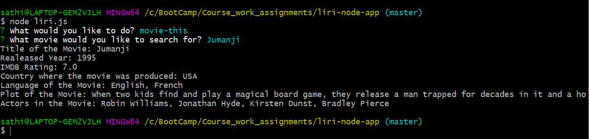
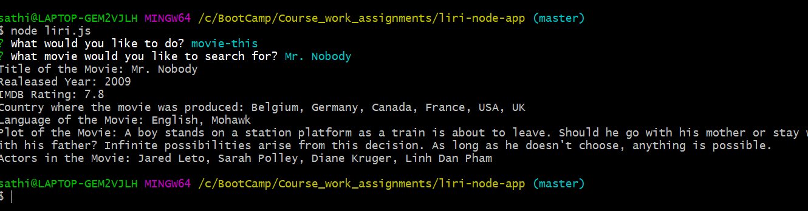
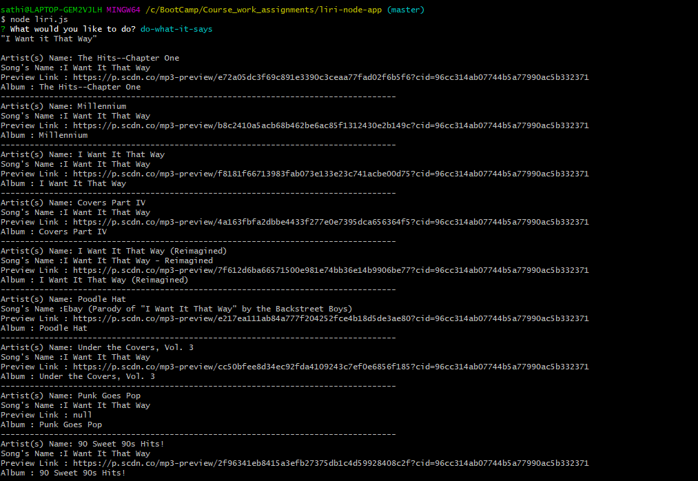

# liri-Bot
### Overview
LIRI is like iPhone's SIRI. However, while SIRI is a Speech Interpretation and Recognition Interface, LIRI is a _Language_ Interpretation and Recognition Interface.
LIRI will be a command line node app that takes in parameters and gives you back data and it is based on Node.js.
 LIRI will search Spotify for songs, Bands in Town for concerts, and OMDB for movies.

Using .gitignore, API keys are stored locally and kept safe through abstraction by .env, having users instead provide their own API keys if they intend to use the app.

All the data input by user is logged into the logs.txt file using fs.appendFile using the logThis() function.

### Built With/Installations Required

*[Node.js] (https://nodejs.org/en/)

*[Node-File-System] (https://nodejs.org/api/fs.html)

*[Axios] (https://www.npmjs.com/package/axios)

*[DotEnv] (https://www.npmjs.com/package/dotenv)

*[JavaScript] (https://www.javascript.com/)

*[Moment.js] (https://www.npmjs.com/package/moment)

*[OMDB-API] (http://www.omdbapi.com)

*[Bandsintown-API] (http://www.artists.bandsintown.com/bandsintown-api)

*[Node-Spotify-API] (https://www.npmjs.com/package/node-spotify-api)

### Command to run the App

1. node liri.js movie-this <movie name>

 *This command searches the movie database in OMDB API through Axios and returns information about the movie.
   It includes 

* Title of the movie
* Year the movie released
* IMDB rating
* Country where the movie produced
* Language of the movie
* Plot of the movie
* Actors in the movie

2. node liri.js spotify-this-song <song-name>

 This command searches the Spotify Web Api which runs on Node.js and returns the song information.
 The output from this command includes
 
 *Artists(s) Name
 *Song's Name
 *Preview link of the song
 *Album
 
 
 
 *If the user doesn't provide any song name then the application returns the default information which is set to "The Sign" by "Ace of Base".
 
  
  
3.node liri.js concert-this <artist/band-name>

*This command searches the Bands in Town Artist Events API through Axios and returns events the artist is appearing at in the near future.
 It includes Venue Name: , Venue Location: , and Date of the Event: . If no artist is entered, the API automatically searches "Backstreet Boys" band information for the user.

![](images/Concert-this2.PNG}

4. node liri.js do-what-it-says

*Using the fs Node package, LIRI accesses the text in random.txt and uses it to call one of LIRI's commands for the user.
 It runs spotify-this-song for "I Want it That Way" by the Backstreet Boys, but can also be modified to search for a specific movie for movie-this,
 or a specific artist for concert-this etc.
 
 
 
5. node liri.js
 
*If no other user input is provided by the user, the terminal returns the message Please enter a valid search term, 
 such as {concert-this}, {spotify-this-song}, {movie-this}, or {do-what-it-says}".
 
 
 